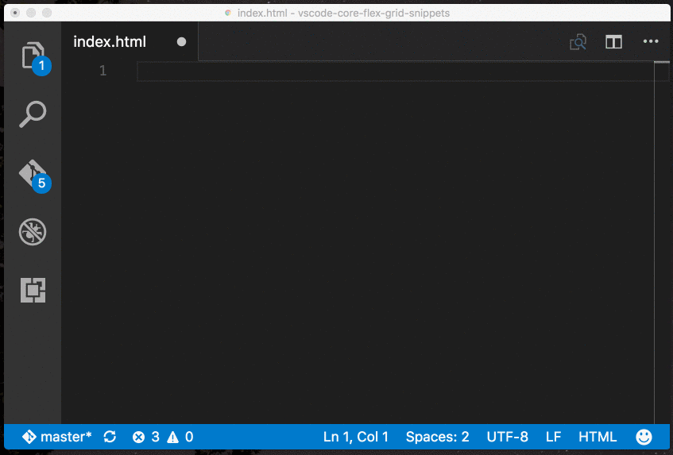
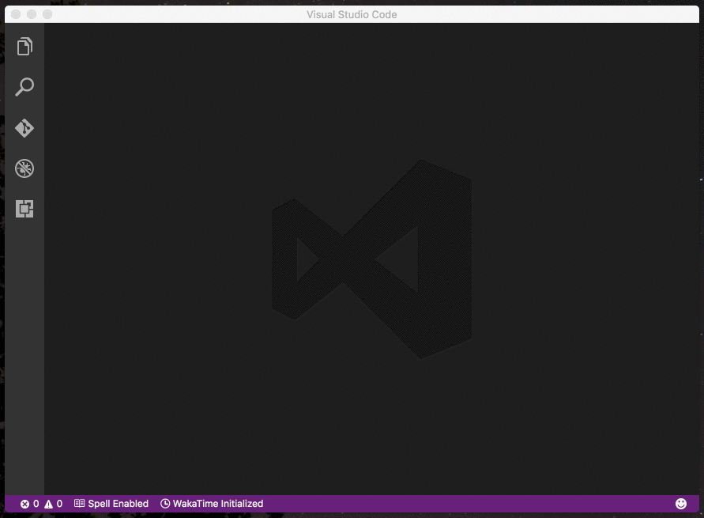

# Blueprint CSS Snippets for VS Code (v0.0.2)
This Visual Studio Code extension adds snippets for Blueprint CSS, a 
Flexbox based CSS grid.

[Blueprint CSS Documentation](https://blueprintcss.io)

## Usage
Type part of a snippet, press `enter`, then tab through the
options to fill in the snippet.



### HTML Snippets
```html
flex-row
flex-col
flex-max
```

### Installation

1. Install Visual Studio Code 0.10.1 or higher
1. Launch Code
1. From the command palette Ctrl-Shift-P (Windows, Linux) or Cmd-Shift-P (OSX)
1. Select Install Extension
1. Choose the extension
1. Reload Visual Studio Code

